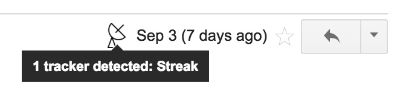

# Email-Tracker-Detector
Detects common Gmail read-tracking systems in incoming messages, and displays an icon indicating which are in use.

# Screenshot

# Credits
- [InboxSDK by Streak](http://www.inboxsdk.com/)
- [Satellite Dish by Creative Stall from the Noun Project](https://thenounproject.com/term/satellite-dish/112104)
